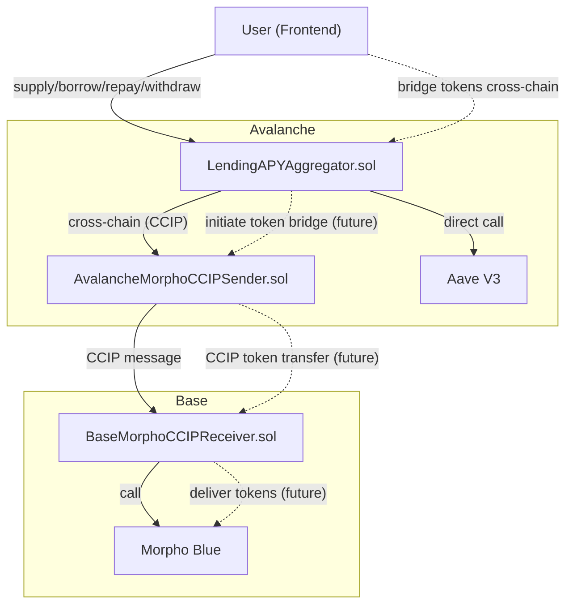
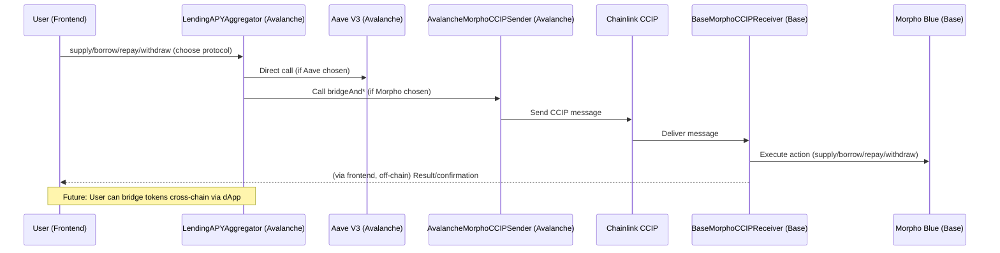

# LendingAPYAggregator

## Overview

**LendingAPYAggregator** is a cross-chain DeFi protocol aggregator that helps users find and access the best lending and borrowing rates across Aave V3 (on Avalanche) and Morpho Blue (on Base). It solves the problem of fragmented DeFi yields by providing a unified interface for users to supply, borrow, repay, and withdraw assets, automatically routing actions to the optimal protocol and chain.

## Problem Statement

DeFi users struggle to find the best lending and borrowing rates across multiple protocols and chains. This project aggregates top rates and enables seamless interaction with both Aave and Morpho, including cross-chain operations.

## Architecture

- **LendingAPYAggregator.sol (Avalanche):** Main contract. Handles user actions (supply, borrow, repay, withdraw), interacts directly with Aave, and routes Morpho actions cross-chain.
- **AvalancheMorphoCCIPSender.sol (Avalanche):** Sends cross-chain messages to Base using Chainlink CCIP for Morpho operations.
- **BaseMorphoCCIPReceiver.sol (Base):** Receives CCIP messages and interacts with Morpho Blue.
- **Mocks & Scripts:** For local testing and deployment automation.

## Cross-Chain Flow

When a user chooses Morpho (on Base) from Avalanche:
1. User interacts with `LendingAPYAggregator` on Avalanche.
2. Aggregator encodes the action and calls `AvalancheMorphoCCIPSender`.
3. `AvalancheMorphoCCIPSender` sends a message via Chainlink CCIP.
4. Chainlink CCIP delivers the message to `BaseMorphoCCIPReceiver` on Base.
5. `BaseMorphoCCIPReceiver` decodes and executes the action on Morpho Blue.

## Supported Protocols
- **Aave V3** (Avalanche)
- **Morpho Blue** (Base)

## User Flows
- **Supply:** User supplies assets to the aggregator, which routes to Aave or bridges to Morpho.
- **Borrow:** User borrows from the chosen protocol.
- **Repay:** User repays debt on the chosen protocol.
- **Withdraw:** User withdraws supplied assets from the chosen protocol.
- **Protocol selection and APY comparison** are handled off-chain (frontend fetches rates and suggests the best option).

## Testing
- **Unit tests:** Cover all contract logic, including edge cases and revert scenarios.
- **Integration tests:** Simulate full user flows and cross-chain messaging using mocks (including a local MockRouter for CCIP simulation).
- **Arbitrary messaging and token bridging** are tested locally with mocks; real cross-chain delivery is tested on testnets.

## Visual Architecture

### Flowchart


### Sequence Diagram


## Deployment
- **Live on:**
  - Avalanche Fuji Testnet
  - Base Testnet
- **Frontend:**
  - [Frontend repository or URL here]

## Future Plans
- **Cross-chain token bridging:** Users will be able to bridge tokens (e.g., AVAX) directly through the dApp to Base for Morpho investments.
- **Support for more protocols and tokens** as Chainlink CCIP and other bridges expand.

## Running Tests
- Install Foundry and dependencies.
- Run all tests:
  ```sh
  forge test
  ```
- Run a specific test file:
  ```sh
  forge test --match-path test/unit/Lending_APY.t.sol
  ```

## Contributing
Pull requests and issues are welcome! For major changes, please open an issue first to discuss what you would like to change.

## License
This project is licensed under the MIT License - see the [LICENSE](LICENSE) file for details.

---

